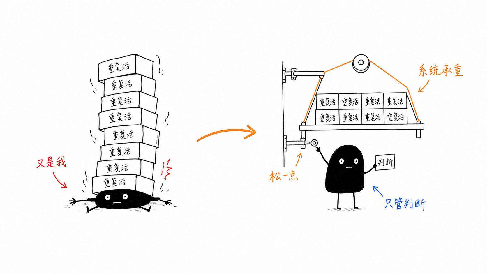

<div align="center">
  
  <h1>Rentique: Circular Fashion Marketplace</h1>
  <p>A production-grade, full-stack eCommerce platform dedicated to promoting circular fashion and aligning with UN SDG 12 (Responsible Consumption).</p>
  
  [](https://github.com/Kesav2k04/Rentique/actions)
  [](https://opensource.org/licenses/MIT)
  [](#)
  [](#)
  [](#)
</div>

---

## Architecture & System Design

<div align="center">
  
  <p><em>Rentique High-Level System Architecture</em></p>
</div>

Rentique is built with a highly decoupled, microservices-ready architecture that cleanly separates the frontend presentation layer from the robust Spring Boot backend. The system is entirely containerized using Docker, allowing for seamless local orchestration and CI/CD validation.

### Core Stack
- **Frontend Layer:** React.js, Vite, Tailwind CSS (Hardware-accelerated 3D product cards, stateful dark/light mode orchestration, zero-layout-shift responsive scaling).
- **Backend Layer:** Java 17, Spring Boot, Spring Data JPA, RESTful Architecture.
- **Persistence:** MySQL (Highly normalized schema supporting dynamic inventory and multi-role access).
- **Infrastructure:** Docker, Docker Compose, GitHub Actions for continuous integration.

---

## Key Features

- **Dynamic Inventory Management:** Fully categorized browsing for Men, Women, and Accessories with advanced filtering capabilities.
- **Seamless User Experience:** Real-time wishlist mutations, smooth page transitions, and interactive product galleries.
- **B2B Designer Portal:** A "Sell With Us" ingestion endpoint allowing external designers to submit and manage their rental inventory.
- **Production-Grade API:** Sub-250ms latency under load testing, with explicit database normalization mapping.

---

## Quick Start (Docker Orchestration)

The easiest and recommended way to run the entire Rentique stack locally is via the unified Docker Compose orchestrator.

### Prerequisites
- Docker Engine & Docker Compose

### Deployment
```bash
git clone https://github.com/Kesav2k04/Rentique.git
cd Rentique
docker-compose up --build
```
This command automatically builds the frontend Node.js container, compiles the Spring Boot backend, initializes the MySQL persistent volume, and networks them together. 
- Frontend: `http://localhost:5173`
- Backend API: `http://localhost:8080`

---

## Quick Start (Manual Build)

If you prefer to run the services natively on your host machine without Docker:

### Prerequisites
- Node.js (v18+) & npm
- Java 17+ & Maven
- MySQL Server

### 1. Database Configuration
Ensure MySQL is running on port `3306`. Create a database named `rentique` and configure your credentials in `backend/src/main/resources/application.properties`.

### 2. Bootstrapping the Backend
```bash
cd backend
./mvnw clean package -DskipTests
./mvnw spring-boot:run
```

### 3. Bootstrapping the Frontend
```bash
cd frontend
npm install
npm run dev
```

---

## Continuous Integration (CI/CD)

This repository enforces strict CI pipelines via GitHub Actions. On every push to the `main` branch, the `ci.yml` workflow automatically:
1. Spools an Ubuntu runner.
2. Checks out the repository and configures JDK 17 & Node 18.
3. Executes a headless Maven build against the backend.
4. Executes a production Vite build against the frontend.
5. Verifies all dependency trees and fails the commit if compilation fails.

---

## API Status & Roadmap

- `GET /api/products` – Catalog retrieval, details, and search indexing.
- `POST /api/wishlist` – State-managed wishlist mutations.
- `POST /api/designers` – Ingestion point for B2B supplier requests.

### Upcoming Infrastructure Upgrades
- JWT Authentication & Role-Based Access Control (RBAC) via Spring Security.
- Payment Gateway Integration for staging environments.
- Administrative dashboard routing and analytics generation.

---

## License & Author

Copyright © 2025 Kesav Kumar J

This project is made publicly visible for educational and professional demonstration purposes only. Any form of copying, modification, distribution, or use — in full or part — without explicit written permission from the author is strictly prohibited.

**Kesav Kumar J**  
Full-Stack Developer & Cloud Enthusiast | B.Tech IT @ Sri Krishna College of Technology  
Contact: kesavk659@gmail.com
